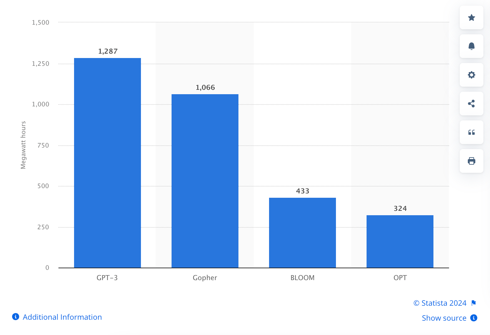

# AI4TypescriptDevelopers
This is a workshop and speaking topics for Typescript developers starting with AI and Langchain.

# Workshop - Introduction to RAG and Langchain for Typescript Developers

## What is LLM?
A large language model (LLM) is a type of artificial intelligence (AI) program that can recognize and generate text, among other tasks. LLMs are trained on huge sets of data — hence the name "large." LLMs are built on machine learning: specifically, a type of neural network called a transformer model.

## How Do Large Language Models Work?
Large Language Models use a blend of neural networks and machine learning (ML). It’s this blend that allows the technology to first process and then generate original text and imagery.
Think of neural networks as the LLM’s brain. It’s these networks that learn from vast amounts of data, improving over time as they’re exposed to more.
As the model is trained on more data, it learns patterns, structures, and the nuances of language. It’s like teaching it the rules of grammar, the rhythm of poetry, and the jargon of technical manuals all at once.
Machine learning models then help the model to predict the next word in a sentence based on the words that come before it. This is done countless times, refining the model’s ability to generate coherent and contextually relevant text.
LLMs now also operate on a Transformer Architecture. This architecture allows the model to look at and weigh the importance of different words in a sentence. It’s the same as when we read a sentence and look for context clues to understand its meaning.
⚠️ While LLMs can generate original content, the quality, relevance, and innovativeness of their output can vary and require human oversight and refinement.
The originality is also influenced by how the prompts are structured, the model’s training data, and the specific capabilities of the LLM in question.

## Use cases of LLMs
### Text generation
The ability to generate text on any topic that the LLM has been trained on is a primary use case.
### Translation
For LLMs trained on multiple languages, the ability to translate from one language to another is a common feature.
### Content summary
Summarizing blocks or multiple pages of text is a useful function of LLMs.
### Rewriting content
Rewriting a section of text is another capability.
### Classification and categorization
An LLM is able to classify and categorize content.
### Sentiment analysis
Most LLMs can be used for sentiment analysis to help users to better understand the intent of a piece of content or a particular response.
### Conversational AI and chatbots
LLMs can enable a conversation with a user in a way that is typically more natural than older generations of AI technologies.

## What is RAG?
RAG stands for Retrieval-Augmented Generation, an AI framework that combines generative AI and traditional information retrieval systems. RAG improves the output of large language models (LLMs) by providing them with relevant data from external sources.

## What is embeddings?
Embeddings are representations of values or objects like text, images, and audio that are designed to be consumed by machine learning models and semantic search algorithms. They translate objects like these into a mathematical form according to the factors or traits each one may or may not have, and the categories they belong to.
Essentially, embeddings enable machine learning models to find similar objects. Given a photo or a document, a machine learning model that uses embeddings could find a similar photo or document. Since embeddings make it possible for computers to understand the relationships between words and other objects, they are foundational for artificial intelligence (AI).

## What is Langchain?
LangChain is a framework for developing applications powered by large language models (LLMs).

LangChain simplifies every stage of the LLM application lifecycle:
- Development: Build your applications using LangChain's open-source building blocks, components, and third-party integrations. Use LangGraph to build stateful agents with first-class streaming and human-in-the-loop support.
- Productionization: Use LangSmith to inspect, monitor and evaluate your chains, so that you can continuously optimize and deploy with confidence.
- Deployment: Turn your LangGraph applications into production-ready APIs and Assistants with LangGraph Cloud.

Components
- Prompts
- LLMs
- Chat models
- Document loaders
- Text splitters
- Embedding models
- Vectorstores
- Retrievers
- Chains

## Vector store
What is a vector in machine learning?
In mathematics, a vector is an array of numbers that define a point in a dimensional space. In more practical terms, a vector is a list of numbers — like {1989, 22, 9, 180}. Each number indicates where the object is along a specified dimension.
In machine learning, the use of vectors makes it possible to search for similar objects. A vector-searching algorithm simply has to find two vectors that are close together in a vector database.
To understand this better, think about latitude and longitude. These two dimensions — north-south and east-west, respectively — can indicate the location of any place on Earth. The city of Vancouver, British Columbia, Canada can be represented as the latitude and longitude coordinates {49°15'40"N, 123°06'50"W}. This list of two values is a simple vector.

## Scalability and Environmental Impact
The scalability of LLMs is tied to the impact it has on the environment. And that impact is turning out to be a big one.

Training a system like GPT-3 took 1,287 Megawatt hours (MWh) of energy. To put that into perspective, 1 MWh could power about 330 homes for one hour in the United States.

The image below shows the energy consumption of training four different LLMs.

## Challenges and Limitations of LLMs
Large language models have come a long way since the early days of Eliza.
In the last two years alone, we’ve seen LLMs power Generative AI and create high-quality text, music, video, and images.
But with any technology, there will always be growing pains.

### Technical Limitations of Language Models
Large Language Models sometimes face technical limitations impacting their accuracy and ability to understand context.

### Domain Mismatch
Models trained on broad datasets may struggle with specific or niche subjects due to a lack of detailed data in those areas. This can lead to inaccuracies or overly generic responses when dealing with specialized knowledge.

### Word Prediction
LLMs often falter with less common words or phrases, impacting their ability to fully understand or accurately generate text involving these terms. This limitation can affect the quality of translation, writing, and technical documentation tasks.

### Real-time Translation Efficiency
While LLMs have made strides in translation accuracy, the computational demands of processing and generating translations in real-time can strain resources, especially for languages with complex grammatical structures or those less represented in training data.

### Hallucinations and Bias
On occasion, LLM technology is too original. So original in fact that it’s making up information.

This is a lesson Air Canada learned the hard way when its chatbot told a customer about a refund policy when no such policy exists, which they then had to honor.
Finally, LLMs can inadvertently propagate and amplify biases present in their training data, leading to outputs that may be discriminatory or offensive.
